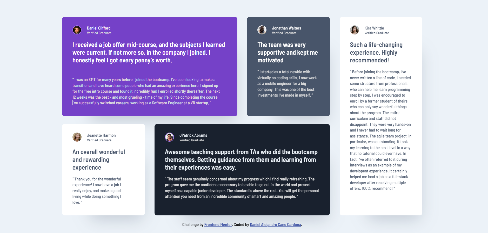

# Frontend Mentor - Four card feature section solution

This is a solution to the **[Testimonials Grid Section](https://www.frontendmentor.io/challenges/testimonials-grid-section-Nnw6J7Un7)** by **[Dacardonac](https://github.com/Dacardonac)**. Frontend Mentor challenges help you improve your coding skills by building realistic projects.

## Table of contents

- [Frontend Mentor - Four card feature section solution](#frontend-mentor---four-card-feature-section-solution)
  - [Table of contents](#table-of-contents)
  - [Overview](#overview)
    - [The challenge](#the-challenge)
    - [Screenshot](#screenshot)
    - [Links](#links)
  - [My process](#my-process)
    - [Built with](#built-with)
    - [What I learned](#what-i-learned)
    - [Continued development](#continued-development)
    - [Useful resources](#useful-resources)
  - [Author](#author)
  - [Acknowledgments](#acknowledgments)

## Overview

### The challenge

**Users should be able to see in this project:**

- View the optimal layout depending on their device's screen size (Responsive)
- Styles in Components (Sass/Scss)
- BEM Methodology

### Screenshot



### Links

- Solution URL: **[Frontend Mentor Solution]()**
- Live Site URL: **[Solution Deploy]()**

## My process

### Built with

- Semantic HTML5 Markup
- CSS3 Custom Properties
- Flexbox
- Mobile-first Workflow
- [Vite](https://vitejs.dev/) - Frontend Tooling
- [Sass/Scss](https://sass-lang.com/) - Modules
- [BEM Methodology](https://getbem.com/) - Classes

### What I learned

I learned and implemented `display: grid;` and `grid-template-areas:`, along with its properties and how to use it. I also reinforced and practiced my CSS knowledge with Sass, and worked on semantic HTML while applying the BEM methodology for class naming."

You can see an example below:

```html

<!-- Semantic Structure with BEM Methodology -->

<section class="content">
    <article class="content__card content__card--purple">
      <div class="content__card-profile">
        <figure class="content__card-image">
          
          <figcaption class="content__card-name">Daniel Clifford<span class="content__card-verified">Verified Graduate</span></figcaption>
        </figure>
      </div>
      <h2 class="content__card-title content__card--purple-title">
        I received a job offer mid-course, and the subjects I learned were current, if not more so,
        in the company I joined. I honestly feel I got every penny’s worth.
      </h2>
      <blockquote class="content__card-paragraph content__card--purple-paragraph">
        “ I was an EMT for many years before I joined the bootcamp. I’ve been looking to make a
        transition and have heard some people who had an amazing experience here. I signed up
        for the free intro course and found it incredibly fun! I enrolled shortly thereafter.
        The next 12 weeks was the best - and most grueling - time of my life. Since completing
        the course, I’ve successfully switched careers, working as a Software Engineer at a VR startup. ”
      </blockquote>
</section>
```

```css

/* Display: grid; */

@media (min-width: 90rem) {
  .content {
    max-width: 90rem;
    display: grid;
    grid-template-columns: 3 1fr 1fr 1fr;
    grid-template-rows: auto;
    justify-content: center;
    column-gap: 1.875rem;
    row-gap: 1.5rem;
    grid-template-areas:
    "--purple --purple --gray --white-two"
    "--white --black --black --white-two";

    &__card {
      margin: 0 auto;
    }

    &__card--purple {
      max-width: 33.75rem;
      grid-area: --purple;
    }
    &__card--gray {
      max-width: 15.938rem;
      grid-area: --gray;
    }
    &__card--white-two {
      max-width: 15.938rem;
      grid-area: --white-two;
    }
    &__card--black {
      max-width: 33.75rem;
      grid-area: --black;
    }
    &__card--white {
      max-width: 15.938rem;
      grid-area: --white;
    }
  }
}
```

### Continued development

With this path, I want to continue learning more about **Responsive Design** and how to work across different devices with **Flexbox** and **Grid**, also I want continue using  **BEM methodology** and perfect the technique in aspects like name the classes, also I want to improve in modularize the component's styles with **Sass** and learn about **Conventional Commits**.

### Useful resources

- **[MDN](https://developer.mozilla.org/en-US/)** - This helped me with **Documentation** on many topics, mostly with **HTML** and **CSS** properties.
- **[ChatGPT](https://chatgpt.com/)** - This is an incredible **Artificial Intelligence (AI)** tool, **ChatGPT** helps me with **specific topics**, **errors in the project** and **investigations**.
- **[Layoutit!](https://layoutit.com/)** - This is an amazing tool that helps me with the **Display Grid**.

## Author

- Frontend Mentor - **[@Dacardonac](https://www.frontendmentor.io/profile/Dacardonac)**
- LinkedIn - **[@Daniel Alejandro Cano Cardona](https://www.linkedin.com/in/daniel-alejandro-cano-cardona/)**

## Acknowledgments

I want to thank **[Jairovg](https://github.com/jairovg)** for the teachings and his help to complete this challenge in a good way and with good practices.